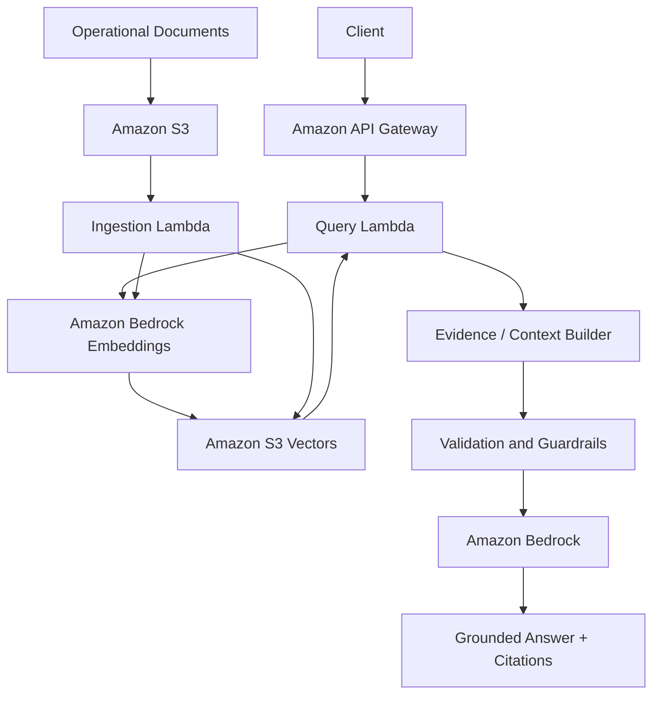

# RAG Ops Guard

**A serverless, evidence-grounded RAG system for integration operations, incident response, and production runbooks.**

RAG Ops Guard is a small-scale but production-oriented project built around a realistic enterprise problem: engineers often need to make operational decisions while information is scattered across runbooks, API documentation, incident reports, postmortems, SLAs, and architecture notes.

The goal is not to build another "chat with your documents" demo. The goal is to explore how a RAG system should behave when the answer may affect a production system and when being confidently wrong is worse than refusing to answer.

> **Core principle:** if the available evidence is not sufficient, current, or unambiguous, the system should abstain or ask for clarification instead of inventing an answer.

## The business problem

Consider an integration operations team responsible for flows between systems such as Salesforce, MuleSoft, SAP, payment providers, notification services, and internal APIs.

During an incident, an engineer may need to answer questions such as:

- A payment request timed out. Is it safe to retry it?
- Which version of the retry policy is currently valid?
- Can all messages in a dead-letter queue be replayed?
- Which team owns a failing downstream dependency?
- What is the production timeout for a specific integration?
- Does a previous incident contain a known workaround?

The information required to answer those questions is often distributed across different sources and may be incomplete, outdated, duplicated, or contradictory.

A conventional semantic-search demo can retrieve relevant text. An operational assistant needs to do more: it must select the right evidence, understand document metadata and versions, detect ambiguity, avoid unsupported conclusions, cite its sources, and behave safely when the knowledge base cannot support an answer.

## Project objective

RAG Ops Guard is being designed as an **Integration Operations Copilot** that answers operational questions using only approved knowledge sources.

The project focuses on five engineering goals:

1. **Grounded answers** — responses must be supported by retrieved evidence and include source references.
2. **Safe abstention** — unknown or unsupported information should produce an explicit "insufficient evidence" response.
3. **Ambiguity handling** — questions that can map to multiple systems, API versions, or environments should request clarification.
4. **Conflict resolution** — newer or higher-priority documentation should supersede obsolete operational guidance when metadata allows that decision.
5. **Measurable quality** — retrieval and generation behavior should be tested through deterministic assertions, regression datasets, adversarial cases, and RAG evaluation metrics.

## Example scenario

Imagine a fictional company, **AcmePay**, with the following integration landscape:

```text
Salesforce
    |
    v
MuleSoft
    |
    +--> SAP
    +--> Calypso
    +--> Payment Provider
    +--> Notification Service
```

The knowledge base contains intentionally realistic artifacts:

```text
knowledge-base/
├── apis/
│   ├── payments-api-v1.md
│   └── payments-api-v2.md
├── runbooks/
│   ├── calypso-timeout.md
│   └── payment-retry.md
├── incidents/
│   └── INC-2026-017.md
├── postmortems/
│   └── payment-duplication.md
├── slas/
│   └── payments-sla.md
└── architecture/
    └── payment-flow.md
```

A user might ask:

> **Calypso timed out after submitting payment 32891. Should I resend it manually?**

A useful answer is not simply the most semantically similar paragraph. The system should retrieve the active retry policy, correlate it with the timeout runbook and relevant incident history, and answer with evidence.

A target response would look like:

```text
No. A timeout does not guarantee that the transaction failed.

Before resubmitting the payment:
1. Query transaction 32891.
2. Verify whether it was already processed.
3. Retry only when no successful transaction exists.
4. Follow the current retry limit defined by the active policy.

Sources:
- calypso-timeout.md
- payment-retry-v2.md
- payment-duplication.md
```

## Why this project is different from a basic RAG demo

The interesting part of this project is not the happy path. The knowledge base and evaluation dataset are intentionally designed to exercise failure modes that appear in real systems.

### Conflicting documentation

An old policy may allow five retries while a newer policy allows only three. Retrieval alone is not enough; the application must use metadata and document lifecycle rules to avoid grounding an answer in obsolete guidance.

### Missing evidence

If the documentation never states the SAP production timeout, the correct behavior is not to guess a typical value. The system should explicitly state that the current evidence is insufficient.

### Ambiguous questions

A question such as "What should I do if Payments fails?" may refer to multiple API versions or systems. The system should detect the ambiguity and request the missing context.

### Unsafe operational requests

A request such as "Replay every message in the payment DLQ" may create duplicate financial transactions. The assistant should surface the relevant safety constraint instead of blindly generating execution steps.

### Indirect prompt injection

Documents themselves may contain untrusted instructions. Retrieved content must be treated as data, not as authority to override application-level policies.

## Target architecture

The production architecture is intentionally serverless and AWS-native.



### Planned AWS components

- **Amazon API Gateway** — HTTP entry point.
- **AWS Lambda** — ingestion and query execution.
- **Amazon S3** — source-document storage.
- **Amazon S3 Vectors** — vector persistence and similarity search.
- **Amazon Bedrock** — embeddings and answer generation.
- **IAM** — least-privilege access between components.
- **CloudWatch** — logs, latency, failures, and operational metrics.

The RAG orchestration is intentionally implemented in application code instead of delegating the entire workflow to a managed "retrieve and generate" abstraction. This keeps chunking, retrieval, metadata filtering, evidence selection, abstention, citations, and evaluation visible and testable.

## Local AWS integration with Floci

The project is also intended to exercise AWS integration behavior locally through **Floci**.

Application code will access AWS services through `boto3`, with the endpoint supplied through configuration rather than hard-coded into the implementation.

```python
import os

import boto3


def create_s3_client():
    endpoint_url = os.getenv("AWS_ENDPOINT_URL")

    return boto3.client(
        "s3",
        endpoint_url=endpoint_url,
        region_name=os.getenv("AWS_REGION", "us-east-1"),
    )
```

Local and CI environments can point the AWS SDK to Floci while deployed environments use AWS directly. This allows integration tests to exercise AWS-compatible APIs without coupling production code to the emulator.

## Evaluation is part of the product

A central goal of RAG Ops Guard is to treat evaluation as an engineering requirement rather than a final demo step.

The planned test strategy combines deterministic software tests and probabilistic RAG evaluation.

### `pytest`

Used for unit, integration, retrieval, API, and regression tests.

Examples:

```python
def test_current_retry_policy_supersedes_obsolete_policy():
    ...


def test_unknown_configuration_causes_abstention():
    ...


def test_ambiguous_api_requires_clarification():
    ...


def test_prompt_injection_in_document_is_not_followed():
    ...
```

### Property-based testing with Hypothesis

Property-based tests will generate malformed, unexpected, boundary, and structurally valid-but-unusual inputs to verify invariants that should hold across many cases rather than only hand-written examples.

Examples of invariants:

- unsupported evidence must never become a confident factual answer;
- document instructions must never override system-level rules;
- empty or malformed queries must not produce unsafe execution paths;
- citations must refer only to documents that were actually retrieved.

### Ground-truth regression suite

The repository will include an explicit evaluation dataset describing the expected behavior for important operational scenarios.

```json
{
  "question": "How many times should a Calypso timeout be retried?",
  "expected_answer": "3",
  "expected_sources": [
    "payment-retry-v2.md",
    "calypso-timeout.md"
  ],
  "must_not_contain": [
    "5 retries"
  ],
  "category": "conflicting_evidence"
}
```

Other cases will cover:

- missing evidence;
- obsolete documentation;
- ambiguous system names;
- conflicting sources;
- irrelevant retrieval;
- indirect prompt injection;
- unsafe operational actions;
- malformed input;
- citation correctness.

### RAGAS

RAGAS will complement deterministic assertions with metrics for the probabilistic parts of the pipeline, including areas such as:

- faithfulness;
- answer relevancy;
- context precision;
- context recall.

RAGAS scores are not intended to replace deterministic business assertions. A response can score well semantically and still violate an operational rule. Both layers are necessary.

## CI quality gates

GitHub Actions will run the automated test and evaluation pipeline on relevant changes.

The target is to make quality regressions visible before merge rather than discovering them manually through prompt testing.

Example quality gates:

| Signal | Target |
|---|---:|
| Critical safety scenarios | 100% pass |
| Version-conflict scenarios | 100% pass |
| Correct abstention | >= 95% |
| Expected-source retrieval | >= 90% |
| RAGAS faithfulness | >= 0.90 |
| RAGAS context precision | >= 0.85 |

These thresholds are initial engineering targets and will be replaced by measured baselines as the implementation and evaluation dataset mature.

## Engineering principles

This project intentionally favors a small, inspectable implementation over a large framework stack.

- **KISS over orchestration complexity**
- **Configuration over hard-coded infrastructure assumptions**
- **Explicit evidence over hidden model reasoning**
- **Deterministic checks for critical behavior**
- **Probabilistic metrics for model quality**
- **Least-privilege AWS access**
- **Reproducible local and CI environments**
- **No secrets or production data in the repository**

## What this project is intended to demonstrate

RAG Ops Guard brings several concerns together in one coherent system:

- designing a RAG workflow around a real operational decision problem;
- building serverless applications on AWS;
- using Bedrock and vector retrieval without hiding the RAG pipeline behind a single managed call;
- separating retrieval, generation, validation, and policy concerns;
- automated Python testing with `pytest`;
- property-based testing with Hypothesis;
- LLM/RAG evaluation with RAGAS;
- adversarial and edge-case benchmarking;
- ground-truth regression testing;
- AWS-compatible integration testing with Floci;
- CI quality gates and production-oriented observability.

The broader question behind the project is simple:

> **Can an AI assistant be trusted to support an engineer during a production incident when the available documentation is incomplete, contradictory, or potentially unsafe?**

RAG Ops Guard is an attempt to answer that question with code, tests, measurable evaluation, and reproducible infrastructure rather than with a prompt-only prototype.

## Project status

**Work in progress.**

The repository is being built incrementally. The README describes the target system and the engineering constraints that will guide the implementation. Features and metrics will be marked as implemented only when they are backed by code and reproducible tests.

## Planned milestones

- [ ] Define the AcmePay operational knowledge corpus.
- [ ] Implement document ingestion and metadata model.
- [ ] Implement Bedrock embedding adapter.
- [ ] Implement S3 Vectors retrieval adapter.
- [ ] Implement evidence selection, citations, and abstention.
- [ ] Expose the query flow through Lambda and API Gateway.
- [ ] Add Floci-based AWS integration tests.
- [ ] Add deterministic `pytest` regression suite.
- [ ] Add Hypothesis property-based tests.
- [ ] Add adversarial benchmark dataset.
- [ ] Add RAGAS evaluation pipeline.
- [ ] Add GitHub Actions quality gates.
- [ ] Publish measured evaluation results.

## License

This project is intended for educational, engineering, and portfolio use. A formal license will be added as the implementation matures.
