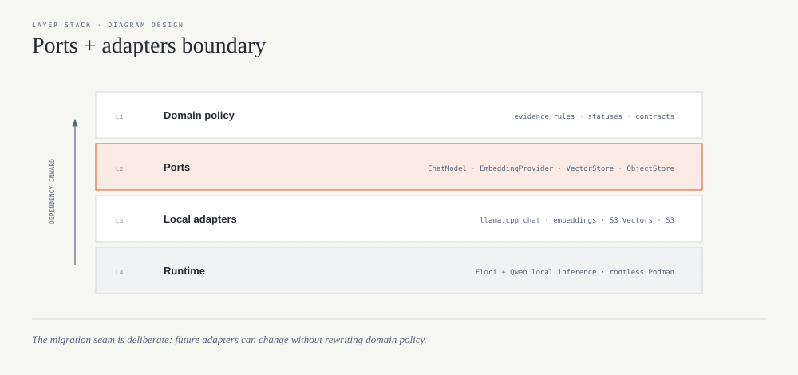

# Architecture — v0.1.0-beta.1

## Goal

RAG Ops Guard answers operational questions from approved runbooks, API documentation, SLAs, incidents, postmortems and architecture notes. The system must prefer abstention over an unsupported answer.

## Local architecture


## Execution profiles

### `local`

Fully local. Floci + two llama.cpp servers. No AWS account or remote inference.

### `local-observed`

Same local inference and storage, with optional LangSmith tracing and experiments.

### `ci`

Floci is real, AI is deterministic. Synthetic embeddings and fake LLM results keep every PR fast and reproducible.

### `aws`

Future profile. Real S3/S3 Vectors/Lambda/API Gateway and Bedrock adapters. It is not part of Beta 1 acceptance.

## Core architectural boundary

The domain depends on Ports, not concrete cloud/AI implementations:



This boundary is the migration seam for future Bedrock adapters.

## Query state machine


A normal query uses at most two generation-model calls: one query-analysis call and one grounded-answer call.

## Evidence policy

The LLM does not choose which document version is authoritative. The deterministic resolver:

1. excludes `deprecated` and `draft` documents for current operational answers;
2. applies explicit system/environment/version context;
3. applies `supersedes` metadata;
4. favors later `effective_date`, then higher `authority`, then newer semantic version;
5. abstains when remaining conflict cannot be resolved safely.

## Storage model

S3 stores source documents, chunk JSON and manifests. S3 Vectors stores 1024-dimensional float vectors and retrieval metadata. Vector metadata contains a pointer back to the authoritative chunk object in S3 rather than duplicating full document text.

Vector key:

```text
{logical_id}:{version}:{chunk_index}:{content_hash_8}
```

## Ingestion idempotency

Each source document has a SHA256 manifest. Re-ingesting identical content returns `no_op`. Changed content under the same logical id/version deletes old vectors and replaces chunks/vectors/manifest.

## Security boundaries

- Evidence is explicitly treated as untrusted data in generation prompts.
- Citation IDs must belong to resolved evidence.
- Direct secret extraction/policy-bypass requests route to `safety_blocked`.
- Operationally risky questions (for example DLQ replay) are not blindly blocked; they are answered from approved runbooks.
- Local endpoints bind only to `127.0.0.1` on the host.
- Real credentials are not required for the local profile.
